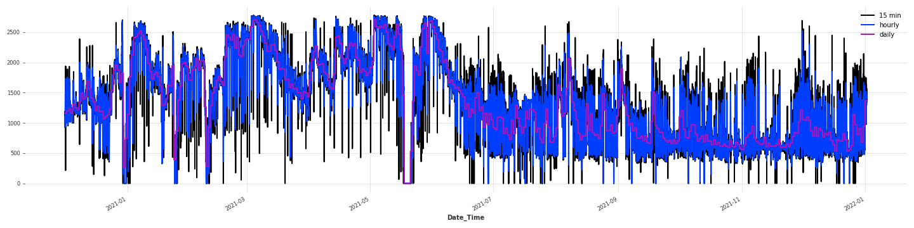

# Hydro power prediction

## Task
The task is to predict day-ahead prouduction curve of a hydro power plant. The following figure showcases an example daily curve:


Notes:
- I always assume the prediction time to be at 00:00 of the previous day. At 31-Dec 00:00 I am making predictions for whole day 1-Jan 00:00 - 23:45.
The time step t is 15 minutes long meaning there are 96 values to be predicted.
- Realized values used for prediction can only be from the previous day hence until 30-Dec 23:45. This applies to the completel daily curve prediction.
- Meteo features are used up until the point of prediction i.e. when predicting for 1-Jan 00:15, I use meteo features up until 1-Jan 00:15.

## Project structure
The project uses ploomber pipelining and has the following structure and tasks:


todo: 

1. mypy check for static typing
2. testing task: data, methods...


## Variance

- Variance of the observed target = huge, need to transform the target to do anything.
- (noisy target - hard for MSE loss functions etc etc...)
- most simple: averaging: hourly, daily -> some loss of information
- (IDEAS: filtering, GP transf.)

### Daily
- daily mean transf. = significant loss of info, but doable for initial analysis
- full analysis in report: **exploratory_target.ipynb**




### **Daily-arima(2,1,1) is the baseline**

On daily, 1 step forward the residuals look good. 


- NOTE: need to do 2 steps prediction, (curve prediction is day ahead)
- (every additional step, the error accumulates)

When I forward fill daily 2 step daily prediction into 15 minute target, the residuals look worse.

NOTES:
- hold out is always from 11-Nov-2021, hence two months dataset
- Multiple ways of model checking for final model, weekly walk forward, daily walk forward.

### **Improve daily?**
Improving the daily with additional features:
- cyclicals: month, week_of_year encoded with sin, cos - usable in linear models
- (note: month 12, close to month 1)
- lagged daily target by two - (day ahead prediction)
- model: simple RF with few estimators fitted on residuals of true-daily - arima-daily
- hyperparams chosen by CV
- 
`ARIMA + RF on DALY RMSE=125 kw`

`ARIMA on DAILY RMSE=117 kw`

RF + ARIMA was worse even on the daily so I did not bother forward filling and checking 15 min.

###  **RNN experiments for daily/hourly.**
Full experiments in **exploratory_darts_daily.ipynb** 

- 340 something days is obv. too small for any complex RNNS.
- Wanted to try if darts framework is any good
- Very simple RNN on daily learns approximately my baseline arima(2,1,1)
- Tried adding meteo covariates as well - no improvement

Hourly
Full experiments in **exploratory_darts_cnn.ipynb**, **exploratory_darts_hourly.ipynb**

- generally I found it difficult to encode the day ahead nature of the problem using darts
- either there were leaks of realized Values that should not be known at the time of prediction
- or the network did not learn anything significant.
- Experimented with loss functions, early stoppers etc in hydro-timeseries.pytorch_utils
- Possible route to take but requires much more time and regularization. 
- too few data points
- TCN, RNNs hard to do on a laptop
- IDEAS: multioutput RNN for regularization [15min, hourly, daily] as a target vector.

### **Detrend + explain residuals**
- Focus on transforming the target,e.g. remove trend and explain the residuals using meteo + other vars
- Use SMAPE as a model selection metric instead of others.
#### **Detrenders:**
**feature_manual.ipynb**


The daily-arima(2,1,1) had the best error metrics hence I chose it as a transformer.


**Transformed target**

- Target is transformed with day-ahead prediction of daily arima
- some residual "trend" seem to remain


### **Meteo features**


Full analysis in **exloratory_meteo.ipynb**


Multiplots - eyecheck for patterns between meteo and target

- positive correlations:
  - STRONG: rising temperature -> rising transpiration
  - WEAK: higher snow_mean -> higher soil_moisture
  - TARGET: soil moisture -> target

- negative correlations:
  - MEDIUM: drop in pressure -> high precip_mean (storm)


Significance is analyzed w.r.t. the transformed target with chosen transformer(i.e. arima-daily(2,1,1))


Top 10 raw meteo vars by abs correlation. soil_moisture, transpiration. Mostly stations 104, 81. 

    | soil_moisture_index_81  | 0.141967 |
    | soil_moisture_index_104 | 0.140683 |
    | soil_moisture_index_20  | 0.139955 |
    | soil_moisture_index_134 | 0.135284 |
    | soil_moisture_index_75  | 0.134490 |
    | evapotranspiration_20   | 0.124984 |
    | evapotranspiration_40   | 0.124436 |
    | evapotranspiration_81   | 0.124313 |
    | pressure_hpa_20         | 0.119161 |
    | evapotranspiration_75   | 0.119053 |

(Tried means across meteo stations for simplicity of further processing - not a good idea. Loss of information.)

                        Results: Ordinary least squares
    =======================================================================
    Model:                OLS               Adj. R-squared:      0.039     
    Dependent Variable:   0.0000            AIC:                 87034.5648
    Date:                 2022-08-24 18:30  BIC:                 87134.7059
    No. Observations:     31104             Log-Likelihood:      -43505.   
    Df Model:             11                F-statistic:         116.7     
    Df Residuals:         31092             Prob (F-statistic):  4.05e-263 
    R-squared:            0.040             Scale:               0.96071   
    -----------------------------------------------------------------------
                             Coef.  Std.Err.    t    P>|t|   [0.025  0.975]
    -----------------------------------------------------------------------
    const                    0.0000   0.0056  0.0000 1.0000 -0.0109  0.0109
    temperature_mean         0.0674   0.0128  5.2602 0.0000  0.0423  0.0925
    evapotranspiration_mean -0.1166   0.0137 -8.5238 0.0000 -0.1434 -0.0898
    snow_mean                0.0230   0.0071  3.2265 0.0013  0.0090  0.0370
    soil_moisture_mean       0.1617   0.0104 15.5221 0.0000  0.1413  0.1821
    pressure_mean            0.1339   0.0060 22.2367 0.0000  0.1221  0.1457
    precip_mean             -0.0086   0.0057 -1.5177 0.1291 -0.0198  0.0025
    sin_month                0.3159   0.0353  8.9583 0.0000  0.2468  0.3850
    cos_month               -0.2227   0.0392 -5.6795 0.0000 -0.2995 -0.1458
    sin_week_of_year        -0.2408   0.0363 -6.6308 0.0000 -0.3120 -0.1696
    cos_week_of_year         0.1502   0.0388  3.8676 0.0001  0.0741  0.2263
    value_detr_daily_lag2   -0.0227   0.0057 -3.9963 0.0001 -0.0338 -0.0116
    -----------------------------------------------------------------------
    Omnibus:               4088.449       Durbin-Watson:          0.090    
    Prob(Omnibus):         0.000          Jarque-Bera (JB):       17873.826
    Skew:                  -0.586         Prob(JB):               0.000    
    Kurtosis:              6.524          Condition No.:          22       
    =======================================================================

Initially the raw features explained only ~4% of variance.

## **Feature engineering**
Both manual and auto generated features.
- Manual features include
  - ewms of all meteo, specific to station, mean, median across stations
  - lagged meteo vars,
  - lagged STL decomposition vars 
  - lagged Value vars(lag 2 due to day ahead)
  - Datetime cyclicals sin, cos encoded
  - ...


### Feature selection
- Tried: MutualInformation, ExtraTreesSelector, LGBMSelector, Lasso, in combination with RFE
- Most stable: Lasso(higher alpha)


### Model selection
- Walk forward checking takes time so initially I chose models using weekly walk forward of prediction month over the final 3-4 months.
- i.e. validation set is 30% of the original
- This creates 13 folds -> some statistic about model perf better than none.


with the best model I then perform day by day walk forward prediction on the hold out.


### Chosen features - weights


 note: weights are unscaled.

### AutoML generated features
Added auto generated features using tsfresh windowing.

- windows were performed on hourly, 15 minute steps etc.. of both realized values and meteo.
- made sure to window correctly
  - Value is windowed so that only D-1 and further back are known at the time of prediction for D+1
  - meteo windowed including the latest value. 


- I used the same Lasso var selection 
- auto generated features did not improve the arima-ridge model.
  


<!-- ##### Sanity checks
- ridge-arima improves slightly upon arima-daily(displayed as a dashed green line). Blue is the actual curve and red is predicted.
- it does not learn the true "variance" of the daily curve


##### Prediction 
saved as csv in **products/data/arima_manual_features.csv**
- green is day ahead daily arima, blue is predicted curve


- note: these two days arima-ridge seem to make prediction with higher variance -->

### Todo
1. STL decomposition in feature-manual, add trend + seasonal + resid. Figure out the period.
2. Self defined objective function for LGBM, smape? 
3. Multiple output NN for regularization - 15 min, 1 hourly, 1 daily.
6. Parquet instead of CSV
7. Long format instead of wide

### Ideas
1. Gaussian process to model the daily curve
2. Introduce temporality through prediction averaging:
   1. Daily - even true mean is not good enough
   2. Hourly?
   3. 30 minute avgs?
3. Parametric models for the daily curve
4. Filtering
5. Other transforms for the noisy target

### Prediction methods
1. [x] ARIMA day ahead baseline - Done
2. [x] ridge-arima improves daily arima with meteo for 15 minutes - Done
3. Gaussian process regressor - gpytorch
4. LGBM with better loss func. (optimize smape more directly?)
5. Multi output RNN - [15min, hourly, daily] - should regularize. (GRU)
6. Bayesian net
7. Tabnet
8. LSTMs - perhaps infeasible, only ~400 days to train for the 96 sequence lengths.


## Setup
Requires [Miniconda](https://docs.conda.io/en/latest/miniconda.html).


```sh
sudo apt install graphviz
conda env create -f environment.yml
conda activate hydro-power-prediction
pip install -e .
ploomber task load-data
ploomber task run-tests
```

### Conda notes
```sh
conda env export -n hydro-power-prediction -f environment.yml --no-builds
conda env create -f environment.yml
conda env update --file environment.yml --prune
```


## Running the pipeline

```sh
ploomber build
```

```sh
ploomber plot --backend pygraphviz
```

#### Best models

Raw:
Trial 61 finished with value: 167.14923047681353 and parameters: 
{'boosting': 'gbdt', 'n_estimators': 910, 'max_depth': 13, 'min_data_in_leaf': 10, 'lambda_l1': 3.0, 'lambda_l2': 3.0}. Best is trial 61 with value: 167.14923047681353.

### SLURM notes
To set up the project inside slurm cluster, do one of the following:

#### run interactive job

srun -p ipu --gres=ipu:1 --cpus-per-task 128 --pty bash -i
